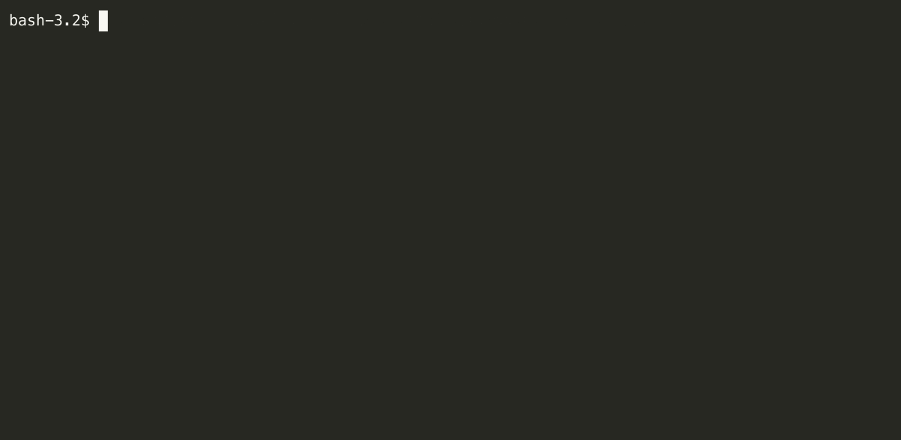

# Zat


A simple project templating system to prevent copy-pasta overload. Zat is inspired by [Giter8](http://www.foundweekends.org/giter8/).

Zat has the following goals:

- It's easy to use
- Has great error messages

## Quick start

To use a remote template use:

```
zat process-remote --repository-url <YOUR_REMOTE_REPOSITORY> --target-dir <WHERE_TO_EXTRACT_THE_REPOSITORY>
```
Some useful remote templates are:

| Template | Command |
| ----- | ---------- |
| [Rust CLI Template](https://github.com/ssanj/rust-cli-zat) | `zat process-remote --repository-url https://github.com/ssanj/rust-cli-zat --target-dir <WHERE_TO_EXTRACT_THE_REPOSITORY>` |
| [Basic Scala 3 Template](https://github.com/ssanj/basic-scala3-zat) | `zat process-remote --repository-url https://github.com/ssanj/basic-scala3-zat --target-dir <WHERE_TO_EXTRACT_THE_REPOSITORY>` |
| [Sublime Text Plugin Template](https://github.com/ssanj/st-plugin-zat) | `zat process-remote --repository-url https://github.com/ssanj/st-plugin-zat --target-dir <WHERE_TO_EXTRACT_THE_REPOSITORY>` |


To use a local template use:

```
zat process --repository-dir  <ZAT_REPOSITORY> --target-dir <WHERE_TO_EXTRACT_THE_REPOSITORY>
```




To setup a new template use:

```
zat bootstrap --repository-dir <ZAT_REPOSITORY>
```


## Installation

### Downloading a Release

Download the latest [release](https://github.com/ssanj/zat/releases) for your operating system (Linux or macOSX).
Make it executable with:

`chmod +x <ZAT_EXEC>`

Copy executable to a directory on your path.

Note: Windows is not explicitly supported at this time as I don't use Windows myself. If you want Windows support and can help with the implementation and testing, get in touch.


### Building through Cargo

You can build Zat through Cargo with:

```
cargo install --git https://github.com/ssanj/zat
```

This will install Zat into your Cargo home directory; usually `~/.cargo/bin`.

### Building from Source

Ensure you have Cargo installed.

Run:

```
cargo build --release
Copy binary file from target/release/zat to a directory on your PATH.
```

### Using Homebrew

You can use [Homebrew](https://brew.sh/) to build Zat from source on macOSX and Linux:

```
brew tap ssanj/homebrew-zat
brew install zat
```

See [Taps](https://docs.brew.sh/Taps) for more information on taps.

Continue onto the [User Manual](docs/user-manual/user-manual.md) for more detailed information on Zat.

