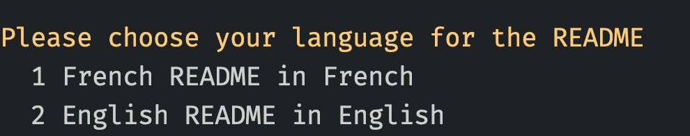

# Choices

Choices let you choose from a list of different options. Choices are currently used to make conditional changes to a template (`tmpl`).

Say for example you wanted to change the rendering of a your `README.tmpl.md` file depending on whether the user chose English or French as the required language:

```md
# $project$


Bonjour!

Hello!

```

Basically we want to render:

```
Bonjour!
```

if the user selected French as the language, and

```
Hello!
```

if the user chose any other language.

The syntax used for the conditional selection of blocks is from the [Tera](https://keats.github.io/tera/docs/#if) templating library.

## Defining choices

Choices can be defined via the `.variables.zat-prompt` file:

```json
  {
    "variable_name": "language_type",
    "description": "Language to use in the README",
    "prompt": "Please choose your language for the README",
    "choice": [
      {
        "display": "French",
        "description": "README in French",
        "value": "french"
      },
      {
        "display": "English",
        "description": "README in English",
        "value": "english"
      }
    ]
  }
```

When a template with a choice, is processed it will output a menu allowing the user to select an option:



After the user makes a choice, the `value` of the choice is stored against the `variable_name`. We can then use the `variable_name` to perform conditionals like:

```

```
