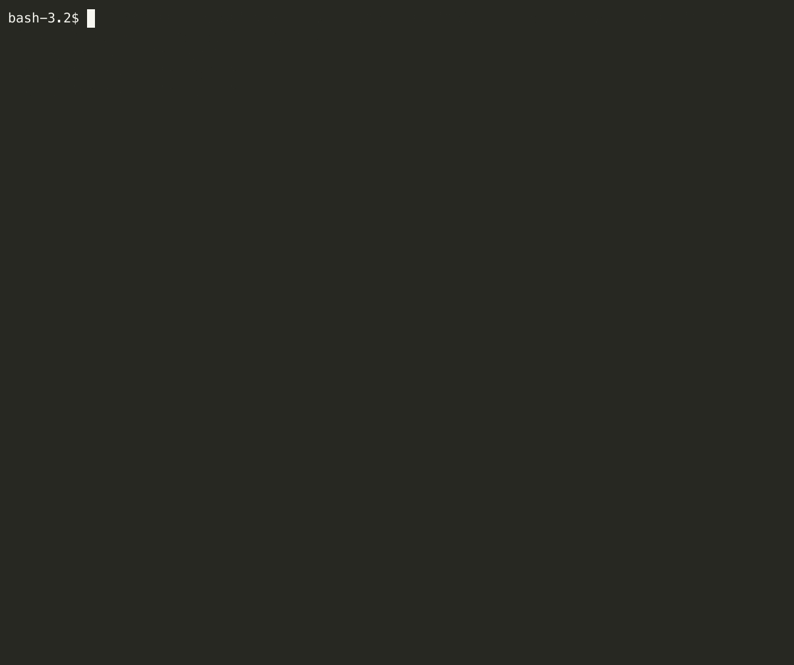

# Choices

Choices let you choose from a list of different options. Choices are currently used to make conditional changes to a template (`tmpl`).

## Defining choices

Choices can be defined via the `.variables.zat-prompt` file:

```json
  {
    "variable_name": "YOUR_CHOICE_NAME",
    "description": "YOUR_CHOICE_DESCRIPTION",
    "prompt": "YOUR_CHOICE_PROMPT",
    "choices": [
      {
        "display": "WHAT_TO_DISPLAY_FOR_CHOICE_ONE",
        "description": "EXTENDED_INFORMATION_FOR_CHOICE_ONE",
        "value": "CHOICE_ONE_VALUE"
      },
      {
        "display": "WHAT_TO_DISPLAY_FOR_CHOICE_TWO",
        "description": "EXTENDED_INFORMATION_FOR_CHOICE_TWO",
        "value": "CHOICE_TWO_VALUE"
      }
    ]
  }
```

For example:

```json
  {
    "variable_name": "language_type",
    "description": "Language to use in the README",
    "prompt": "Please choose your language for the README",
    "choices": [
      {
        "display": "French",
        "description": "README in French",
        "value": "french"
      },
      {
        "display": "English",
        "description": "README in English",
        "value": "english"
      },
      {
        "display": "Spanish",
        "description": "README in Spanish",
        "value": "spanish"
      }
    ]
  }
```


When a template with a choice is processed, it will output a menu allowing the user to select an option:



After the user makes a choice, the `value` of the choice is stored against the `variable_name`.  In the above example when the user
selects the "French" language option the value of `french` will be stored against the `language_type` variable name.

We can then use the `variable_name` to perform conditionals.

The syntax used for the conditional selection of blocks is from the [Tera](https://keats.github.io/tera/docs/#if) templating library and takes the
following format:

```

  //block1

  //block2

  //block3

```

Using the above example:


```

  //block1

  //block2

  //block3

```

Using the above example:

```

Bonjour!

Hola!

Hello!

```

Also note that choices will be displayed first, before all other variables. This is because which variables are displayed next can depend on the choices taken and the scopes added to subsequent variables. See [scopes](scopes.md) for more information.
