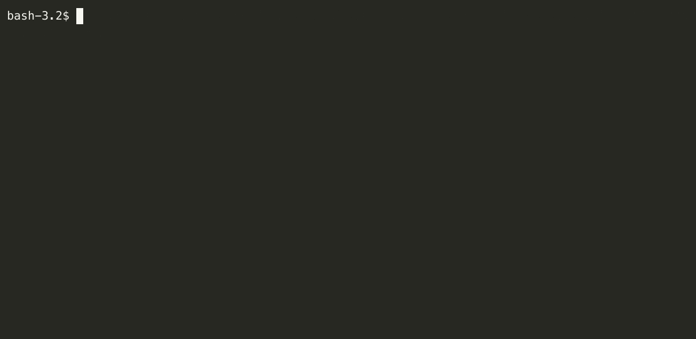

# Other Options

## Choosing the choice menu style

You can choose between one of two styles for how choice menus are displayed:
1. Selection (default)
1. Numbered


`selection` is the default:




This can be changed by supplying the optional `choice-menu-style` argument to `Zat`:

```
 zat process --repository-dir <REPOSITORY_DIRECTORY> --target-dir <TARGET_DIR> --choice-menu-style <CHOICE_MENU_STYLE>
```

For example, to use the `numbered` style, we could use:

```
 zat process --repository-dir <REPOSITORY_DIRECTORY> --target-dir <TARGET_DIR> --choice-menu-style numbered
```


