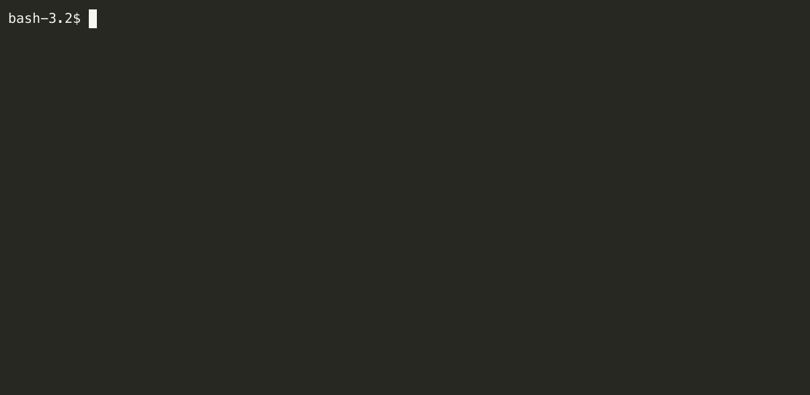
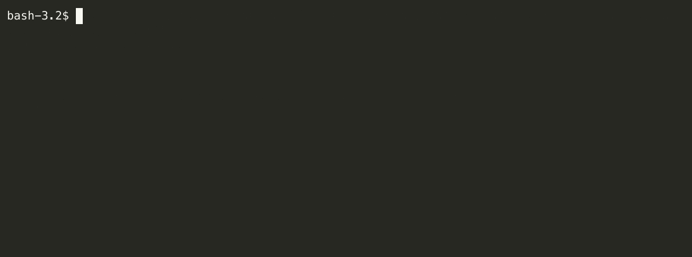

# Other Options

## Choosing the choice menu style

You can choose between one of two styles for how choice menus are displayed:
1. Selection (default)
1. Numbered


`selection` is the default:




This can be changed by supplying the optional `choice-menu-style` argument to `Zat`:

```
 zat process --repository-dir <REPOSITORY_DIRECTORY> --target-dir <TARGET_DIR> --choice-menu-style <CHOICE_MENU_STYLE>
```

For example, to use the `numbered` style, we could use:

```
 zat process --repository-dir <REPOSITORY_DIRECTORY> --target-dir <TARGET_DIR> --choice-menu-style numbered
```


## Using a repository file for remote repositories

You can also create a JSON file with any frequently used remote repositories

Using `sample-remote-config.json` as an example:

```json
[
  {
    "name": "Rust CLI Template",
    "description": "A Rust template with clap, serde, walkdir and ansi_term",
    "url": "https://github.com/ssanj/rust-cli-zat"
  },
  {
    "name": "Scala 3 Template",
    "description": "A Scala 3 template with Scala3 and MUnit",
    "url": "https://github.com/ssanj/basic-scala3-latest-deps-zat"
  },
  {
    "name": "Sublime Text 3 Plugin Template",
    "description": "A template for creating a ST3 plugin",
    "url": "https://github.com/ssanj/st-plugin-zat"
  }
]
```

You can call `Zat` with:

```
zat process-remote --repository-file sample-remote-config.json
```



The schema for a remote config file can be found in the `remote-config.schema.json` file.
